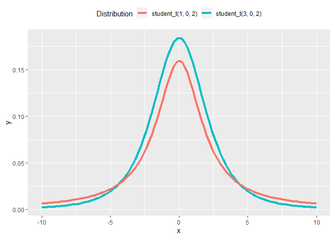

<!-- README.md is generated from README.Rmd. Please edit that file -->

# standist

<!-- badges: start -->

<!-- badges: end -->

The goal of standist is to …

## Installation

You can install the development version from
[GitHub](https://github.com/) with:

``` r
# install.packages("devtools")
devtools::install_github("jmgirard/standist")
```

## Example

``` r
library(standist)
d_student_t(x = -10:10, nu = 3, mu = 0, sigma = 2)
#>  [1] 0.002109677 0.003059751 0.004581681 0.007112009 0.011486019
#>  [6] 0.019330743 0.033754830 0.060008587 0.103374168 0.156590456
#> [11] 0.183776298 0.156590456 0.103374168 0.060008587 0.033754830
#> [16] 0.019330743 0.011486019 0.007112009 0.004581681 0.003059751
#> [21] 0.002109677
```

``` r
visualize("student_t(3, 0, 2)", xlim = c(-10, 10))
```


``` r
visualize("student_t(3, 0, 2)", "student_t(1, 0, 2)", xlim = c(-10, 10))
```



## Contributor Code of Conduct

Please note that the ‘standist’ project is released with a [Contributor
Code of Conduct](.github/CODE_OF_CONDUCT.md). By contributing to this
project, you agree to abide by its terms.
